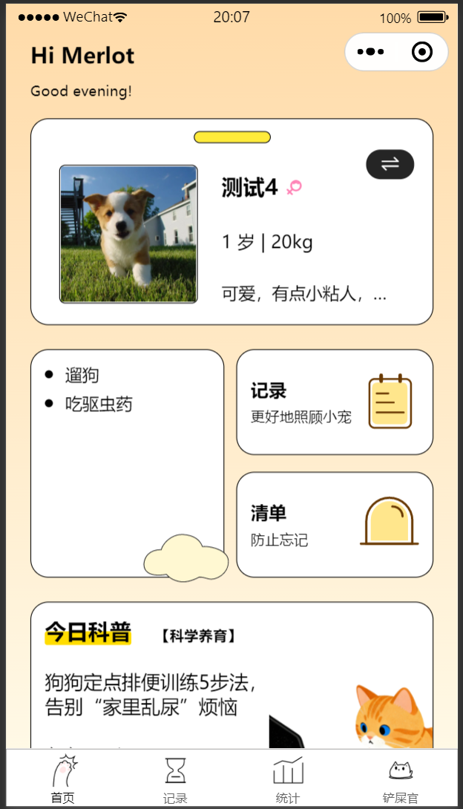
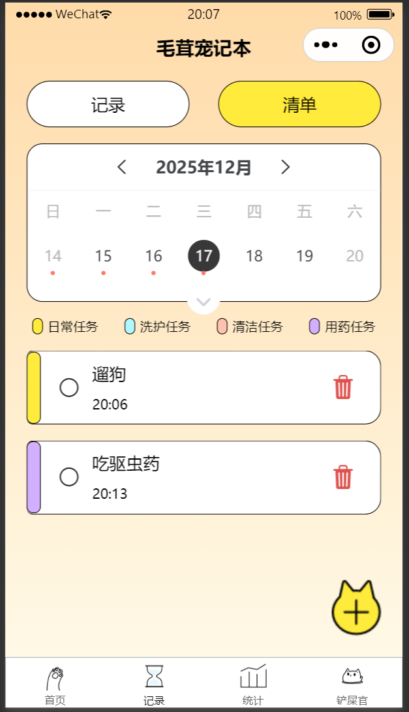
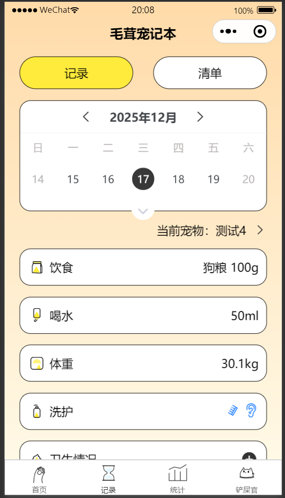
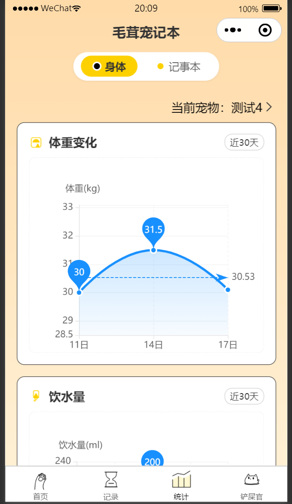
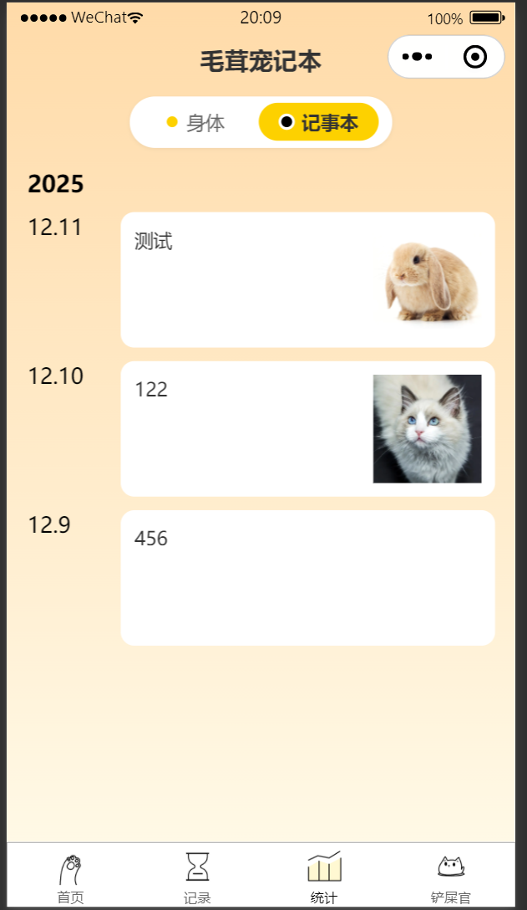
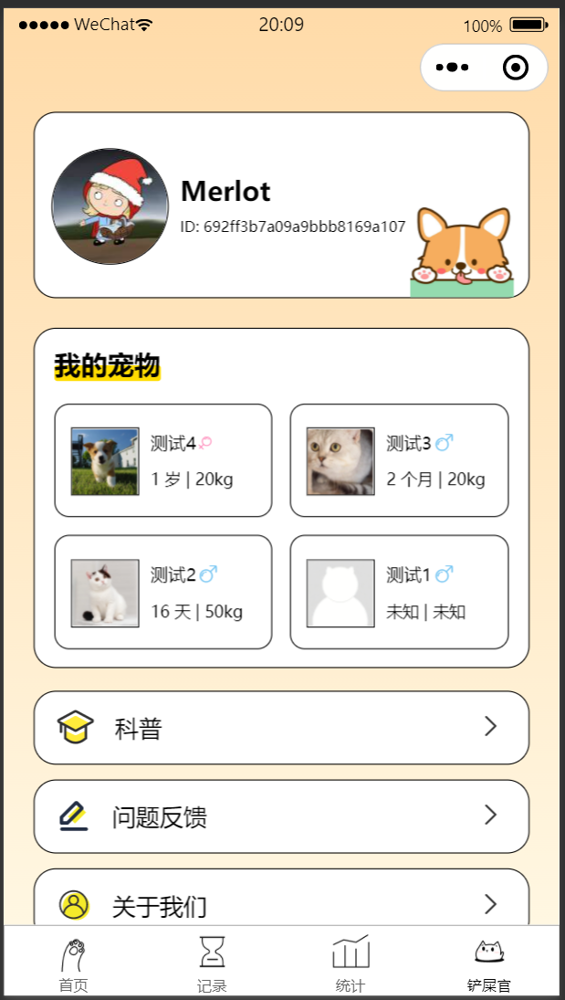
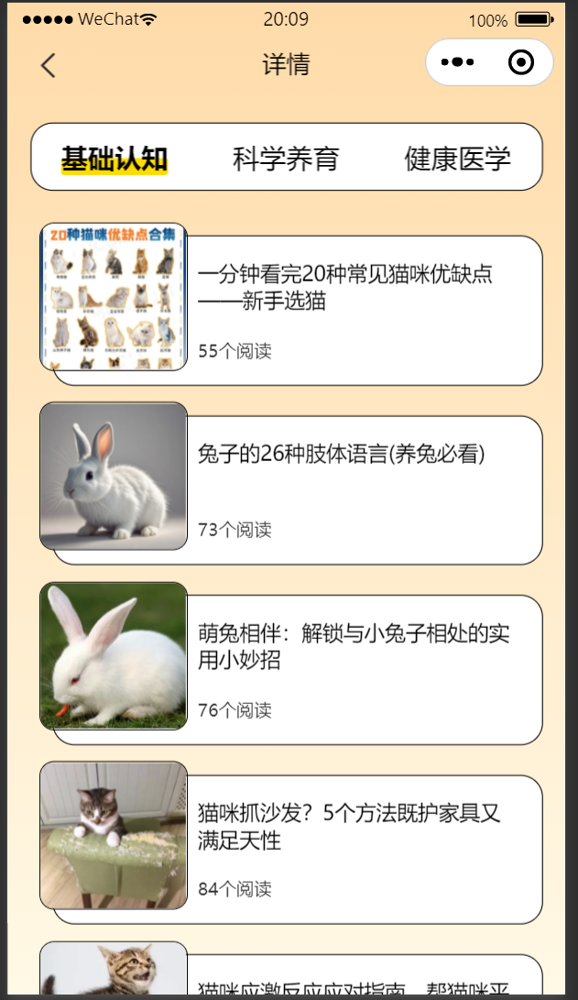
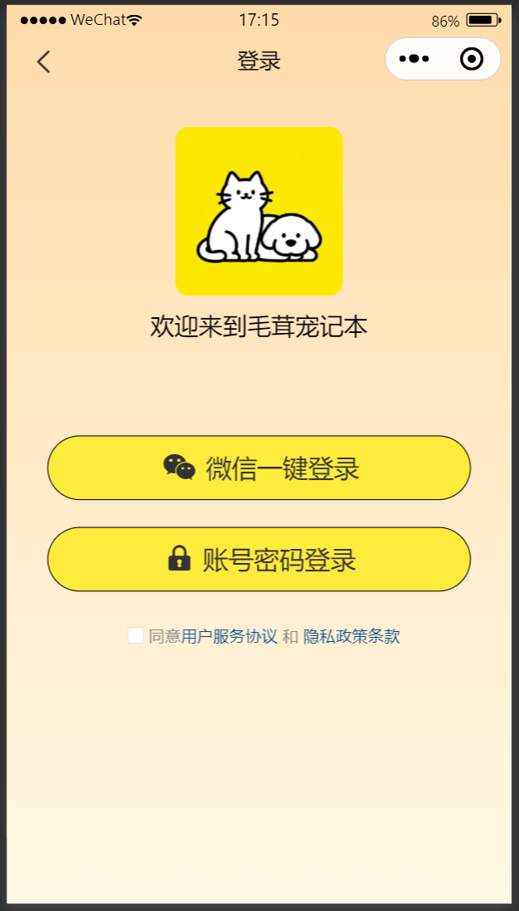

# 毛茸宠记本 🐾

> 一款基于 **uni-app + uniCloud** 的宠物日常记录与护理小程序，多端运行（H5 / 微信小程序 / Android / iOS），用一篇"日记"的方式，把毛孩子的生活点点滴滴串起来。

[](https://vuejs.org)
[](https://uniapp.dcloud.net.cn)
[](https://unicloud.dcloud.net.cn)

---

## ✨ 项目简介

「毛茸宠记本」是面向铲屎官的一款**轻量级宠物生活记录工具**：

- 🐶 **多宠物管理**：可以添加多只宠物，每只宠物独立的资料（头像、性别、品种、出生日期、是否绝育、性格等）
- 📝 **日常 7 维记录**：饮食 / 喝水 / 体重 / 洗护 / 卫生 / 记事 / 运动，每一类都有专属弹窗和数据可视化
- ⏰ **任务清单**：按日历管理每日提醒（喂药、驱虫、洗澡等），支持完成状态切换
- 📊 **健康统计**：体重、饮水量趋势图（基于 ECharts + uCharts）
- 📚 **宠物科普**：每日推送科普文章，支持分类与详情阅读
- 🌗 **统一用户体验**：一套代码，多端运行（小程序 + H5 + 原生 App）

## 📸 项目展示

**首页**



**记录页**




**统计页**




**个人中心页**



**科普文章页**



**登录页**



## 🚀 功能特性

### 已实现
- ✅ 微信小程序一键登录 + 账号密码登录（基于 uni-id）
- ✅ 个人信息编辑（头像、昵称、ID 复制）
- ✅ 宠物 CRUD（添加 / 编辑 / 删除 / 切换当前宠物）
- ✅ 7 类日常记录（饮食/喝水/体重/洗护/卫生/记事/运动）的录入与展示
- ✅ 任务/提醒管理（日历视图、按类型分类、完成状态切换）
- ✅ 体重变化折线图、饮水量折线图
- ✅ 宠物科普文章列表 + 详情
- ✅ 全局状态管理（Pinia + pinia-plugin-persistedstate）
- ✅ 自定义导航栏 + 状态栏适配

## 🛠️ 技术栈

### 前端
- **uni-app** —— 一码多端框架
- **Vue 3**（Composition API + `<script setup>` 为主，少量 Vue 2 Options API 兼容）
- **Pinia** —— 状态管理，配合 `pinia-plugin-persistedstate` 做持久化
- **Vite** —— 构建工具（uni-app 编译器内置）
- **SCSS** —— 样式预处理

### UI 库
- **@dcloudio/uni-ui** —— uni-app 官方 UI 库
- **@climblee/uv-ui** —— UV UI 组件库
- **@qiun/ucharts** + **ECharts** —— 双图表方案（按场景选型）

### 后端
- **uniCloud** —— DCloud 提供的 serverless 云开发平台
- **阿里云** —— 当前部署的云厂商（在 `uniCloud-aliyun/` 目录）
- **uni-id** —— 统一身份认证方案
- **云对象（Cloud Object）** —— `client-pet` / `client-record-*` / `client-task` / `client-science` 等

### 工具
- **dayjs** —— 日期处理
- **xe-utils** —— 通用工具函数
- **pnpm** —— 包管理（推荐）

## 📂 目录结构

```
.
├── App.vue                      # 应用入口组件
├── main.js                      # 入口 JS（Vue 2/3 双分支）
├── manifest.json                # uni-app 应用清单（AppID、SDK、权限）
├── pages.json                   # 页面路由 + tabBar + 分包配置
├── uni.scss                     # 全局 SCSS 变量
├── config.js                    # 项目配置（CDN 静态资源地址）
├── index.html                   # H5 入口
├── uni.promisify.adaptor.js     # Vue 2 异步 API Promise 化
│
├── pages/                       # 主页面（Tab 页 + 内嵌页）
│   ├── index/                   # 首页
│   ├── record/                  # 记录 + 清单 + 添加任务
│   ├── statistic/               # 统计图表
│   └── my/                      # 我的 + 我的宠物
│
├── pagesMy/                     # 「我的」分包
│   ├── aboutUs/                 # 关于我们（含版本号）
│   ├── service/                 # 用户协议
│   └── privacy/                 # 隐私政策
│
├── pagesPet/                    # 「宠物」分包
│   └── addPet/                  # 添加/修改宠物
│
├── components/                  # 公共组件
│   ├── status-bar/              # 状态栏占位（刘海屏适配）
│   ├── myPet/                   # 我的宠物列表弹窗
│   └── bill/                    # 账单（占位）
│
├── store/                       # Pinia 状态
│   ├── pet.js                   # 宠物相关（首页/记录/统计各自的当前宠物）
│   ├── record.js                # 当日记录数据
│   └── calendar.js              # 日历状态
│
├── utils/                       # 工具函数
│   ├── common.js                # 通用（上传、弹窗、URL 序列化）
│   └── version.js               # 应用版本号（与 manifest.json 同步）
│
├── common/                      # 全局公共
│   └── style/                   # 全局样式（common-style.css + iconfont.css）
│
├── static/                      # 静态资源
│   ├── image/                   # 图片（兜底头像、Logo、加号图等）
│   ├── tabBar/                  # tabBar 图标
│   └── ...
│
├── uniCloud-aliyun/             # uniCloud 后端（阿里云）
│   ├── cloudfunctions/
│   │   ├── fuzzy-news/          # 业务云对象（client-pet / client-record-* / client-task / client-science）
│   │   └── common/utils/        # 公共工具云函数
│   └── database/
│       ├── fuzzy-news-articles.schema.json
│       └── JQL查询.jql
│
├── uni_modules/                 # 第三方 uni-app 插件（含 uni-id、uv-ui、ucharts 等）
│
└── unpackage/                   # 构建产物（已 gitignore）
```

## 🏃 快速开始

### 环境要求

- **HBuilderX 3.x**（推荐）或 **CLI 版 uni-app**
- **Node.js** ≥ 18
- **pnpm** ≥ 8（或 npm / yarn）
- **微信开发者工具**（预览小程序用）

### 1. 克隆并安装依赖

```bash
https://github.com/cc-Merlot/fuzzy-note
cd fuzzy-note
pnpm install
```

### 2. 关联 uniCloud 空间

> ⚠️ **本项目使用了 uniCloud serverless 服务，需要单独创建云空间。**

1. 注册 [DCloud 账号](https://dev.dcloud.net.cn)
2. 在 [uniCloud 控制台](https://unicloud.dcloud.net.cn) 创建一个**阿里云**免费版空间
3. 在 HBuilderX 中：**右键 `uniCloud-aliyun` 目录 → 关联云空间或项目**
4. 上传云函数/云对象：
   - 右键 `uniCloud-aliyun/cloudfunctions/common/utils` → 上传部署
   - 右键 `uniCloud-aliyun/cloudfunctions/fuzzy-news` → 上传部署
5. 上传数据库 schema：右键 `uniCloud-aliyun/database/fuzzy-news-articles.schema.json` → 上传 DB Schema

### 3. 配置 uni-id（敏感信息）

仓库里只保留了**配置模板** `config.example.json`，真实配置走"本地复制 + 上传云端"流程，避免敏感信息泄露到 git 历史。

```bash
# 1. 复制模板为真实配置（此文件已在 .gitignore 中，不会被提交）
cp uni_modules/uni-config-center/uniCloud/cloudfunctions/common/uni-config-center/uni-id/config.example.json \
   uni_modules/uni-config-center/uniCloud/cloudfunctions/common/uni-config-center/uni-id/config.json
```

然后编辑新生成的 `config.json`，至少填入以下字段：

- `passwordSecret[0].value` —— 密码加密盐（任意字符串）
- `tokenSecret` —— token 签名密钥（任意字符串）
- `mp-weixin.oauth.weixin.appid` —— 微信小程序 AppID
- `mp-weixin.oauth.weixin.appsecret` —— 微信小程序 AppSecret（在[微信公众平台](https://mp.weixin.qq.com)获取）

### 4. 配置微信小程序 AppID（manifest.json）

打开 `manifest.json`，将 `mp-weixin.appid` 改为**你自己的小程序 AppID**（与第 3 步中 `config.json` 填的 appid **保持一致**）。

### 5. 启动开发

- **HBuilderX**：菜单 `运行 → 运行到浏览器 → Chrome` 或 `运行到小程序模拟器 → 微信开发者工具`
- **CLI**：
  ```bash
  # H5
  pnpm dev:h5
  # 微信小程序
  pnpm dev:mp-weixin
  ```

### 6. 预览

在 HBuilderX 控制台会输出访问地址（默认 H5 为 `http://localhost:5173`），或在微信开发者工具中预览小程序。

## 🚢 部署

### 微信小程序

1. 在 `manifest.json` 配置好 AppID
2. HBuilderX 菜单 `发行 → 小程序-微信`
3. 在微信开发者工具中"上传"并填写版本号
4. 登录[微信公众平台](https://mp.weixin.qq.com)提交审核

---

> 如果觉得这个项目对你有帮助，欢迎点个 ⭐ Star 支持一下！
